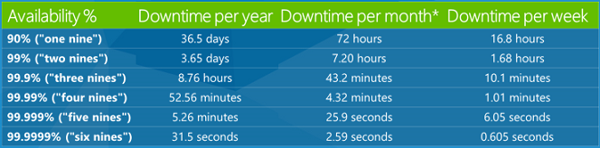

# # Understanding Software Dynamics Ch.01 - 너무 느린 내 프로그램

## 책 내용 정리 (희망하는 사람만)

## 좋았던 부분

## 새로 배운 내용

## 책의 내용과 관련한 본인의 경험 (실무 경험, 프로젝트 경험)

## 데모 시연 (준비한 사람만) or 코드 조각

## 내용을 복습하기 위한 유튜브 링크나 논문 혹은 참고 자료들

- [1.6 절] 크기 정도 산정
  - `이 책에서 다른 규정이 없는 한 항상 "n의 거듭제곱"에 대해 O(n) 표기법을 사용해 구체적인 단위를 지정하는 십진법을 사용한다.`
  - 2009년 제프 딘의 '모두가 알아야 하는 숫자들' [^deen2009]
  - 위 두 내용에 대해 다음 책에서도 동일한 내용이 언급됩니다.
    - 가상 면접 사례로 배우는 대규모 시스템 설계 기초 - 알렉스 쉬 [^interview1]
      - [^interview1] p.33 [2장 개략적인 규모 추정]
```text
p.33
시스템 설계 면접을 볼때, 때로는 시스템 용량이나 성능 요구사항을 개략적으로 추정해 보라는 요구를 받게 된다. 
구글의 시니어 펠로 제프 딘에 따르면, 
"개략적인 규모 추정은 보편적으로 통용되는 성능 수치상에서 사고 실험(thought-experiments)을 행하여 추정치를 계산하는 행위로서, 
어떤 설계가 요구사항에 부합 할 것인지 보기 위한 것"이다.

개략적 규모 추정을 효과적으로  해 내려면 규모 확장성을 표한하는 데 필요한 기본기에 능숙해야 한다.
특히, 2의 제복수나 응답지연(latency) 값, 그리고 가용성에 관계된 수치들을 기본적으로 잘 이해하고 있어야 한다.
```

```text
p.35
'모두가 알아야 하는 숫자들'에 따르면 다음과 같은 결론이 나온다.

- 메모리는 빠르지만 디스크는 아직도 느리다.
- 디스크 탐색(seek)은 가능한 한 피하라
- 단순한 압축 알고리즘은 빠르다.
- 데이터를 인터넷으로 전송하기 전에 가능하면 압축하라.
- 데이터 센터는 보통 여러지역(region) 에 분산되어 있고, 센터들 간에 데이터를 주고받는 데는 시간이 걸린다.
```

```text
p.36
[가용성에 관계된 수치들]
고가용성(High availability)은 시스템이 오랜 시간 동안 지속적으로 중단 없이 운영될 수 있는 능력을 지칭하는 용어다.
고가용성을 표현하는 값은 퍼센트로 표현하는데, 100%는 시스템이 단 한번도 중단된 적이 없었음을 의미한다.
대부분의 서비스는 99%에서 100% 상디의 값을 갖는다.

SLA(Service Level Agreement)는 서비스 사업자(service provider)가 보편적으로 사용하는 용어로,
서비스 사업자와 고객 사이에 맺어진 합의를 의미한다.

이 합의에는 서비스 사업자가 제공하는 서비스의 가용시간(uptime)이 공식적으로 기술되어 있다.
아마존, 구글, 그리고 마이크로소프트 같은 사업자는 99% 이상의 SLA를 제공한다.

가용시간은 관습적으로 숫자 9를 사용해 표시한다.
9가 많으면 많을수록 좋다고 보면 된다. 
```

 [^azure-sla]

- SLA 와 장애 관련하여, 다른 세미나 참관 기록 [^SLA-fault-seminar]
```text
[서비스 장애의 범위]
- 민감도 (범위)
    - 사용자
    - 기능
- 심각도 (규모)
    - 물질적 손해 (손해, 배상금, LTV(고객 생애 가치, 고객의 편익에 끼친 손해), 등)
    - 신뢰 (SLA 수치로 판단, 리텐션과 growth에 영향을 줍니다.)
```
LTV 고객 생애 가치 : https://en.wikipedia.org/wiki/Customer_lifetime_value


[^interview1]: https://www.yes24.com/Product/Goods/102819435
[^deen2009]: pdf p.24 - https://www.cs.cornell.edu/projects/ladis2009/talks/dean-keynote-ladis2009.pdf
[^azure-sla]: https://learn.microsoft.com/ko-kr/aspnet/aspnet/overview/developing-apps-with-windows-azure/building-real-world-cloud-apps-with-windows-azure/design-to-survive-failures#slas
[^SLA-fault-seminar]: https://github.com/suyeon-jung-dev/suyeon-jung-dev/blob/main/learning-records/etc/%EC%84%9C%EB%B9%84%EC%8A%A4%EC%9E%A5%EC%95%A0%EC%9E%98%EC%9D%B4%ED%95%B4%ED%95%98%EA%B3%A0%EB%8C%80%EC%B2%98%ED%95%98%EA%B8%B0.md

## 이해 안되거나 모르는 부분

## 그외 자유롭게 작성

