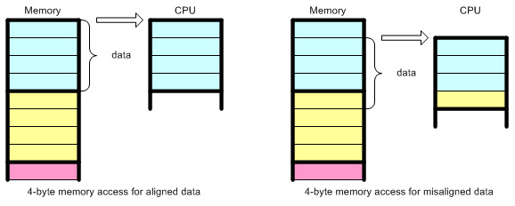

# Understanding Software Dynamics Ch.03

## 책 내용 정리
3.4 데이터 정렬
프로세서는 한 번에 4byte(=1 word)씩 데이터를 읽어오기 때문에, 실제 캐시와 메모리 접근은 정렬된 양만큼만 수행된다. \
(ex) aligned data와 misaligned data의 메모리 접근 차이 \

- aligned data: 1회 접근
- misaligned data: 2회 접근
- https://hackmd.io/@austinyhc/B10-WhT8o

3.5 TLB 구조
- TLB: 가상 주소 -> 물리 주소로 변환하는 정보를 저장하는 캐시
- 1차 TLB와 2차 TLB로 구성되며, CPU 성능에 큰 영향을 미친다.
- c.f. 캐시: CPU와 주 메모리 사이에 위치하여 자주 사용되는 데이터와 명령어에 대한 빠른 접근을 제공
  - 멀티 프로세서 시스템에서는 캐시 일관성 문제가 발생할 수 있다: 여러 프로세서가 동일한 데이터의 서로 다른 복사본을 가질 때
    - 해결방안: Write-through(정보를 변경할 때마다 즉시 메인 메모리에 반영), Write-back with broadcasting(변경사항을 즉시 다른 모든 캐시에 브로드캐스트), 캐시 일관성 프로토콜(각 데이터에 상태를 부여하여 관리)
  - 페이지 크기에 따라 캐시 관리 전략이 달라짐
    - 작은 페이지는 세밀한 메모리 관리를 가능하게 하지만 관리 오버헤드가 큼
    - 큰 페이지는 관리가 쉽고 TLB 효율성이 높지만, 메모리 낭비와 캐시 비효율성을 초래할 수 있다.

3.7 캐시 라인 크기 측정
- 캐시 라인: 캐시 메모리가 주 메모리에서 데이터를 가져올 때의 최소 단위이다. 즉, CPU가 메모리의 특정 주소에 있는 데이터를 요청하면, 캐시는 그 주소를 포함한 전체 캐시 라인을 가져옴
- 캐시 라인 크기 측정의 기본 원리:
  - 데이터를 연속적으로 접근할 때, 캐시 라인 크기만큼 데이터가 한 번에 캐시로 로드된다.
  - cache Hit: 캐시 라인 크기보다 작은 간격으로 데이터에 접근
  - cache Miss: 캐시 라인 크기보다 큰 간격으로 접근
  - 그림 3.5a, 3.5b: 접근 간격이 작을수록 더 많은 데이터가 같은 캐시 라인에 위치하여 캐시 효율성이 높아진다. 
  - 그림 3.5c: 접근 간격이 캐시 라인 크기와 같거나 클 경우 모든 접근마다 새로운 캐시 라인을 가져와야 하므로 캐시 미스가 자주 발생한다. 그리고 너무 큰 간격은 메모리와 캐시 사용의 비효율성을 초래할 수 있다.
- 측정 방법:
  - X바이트 간격으로 메모리에 접근하며 접근 시간 측정
  - X를 점진적으로 증가시키면서 접근 시간 측정
  - 접근 시간이 급격히 증가하는 지점이 캐시 라인 크기이다.
- 그림 3.6: 캐시 라인 크기와 접근 패턴에 따른 CPU 사이클 수(실행 시간)의 변화
  - X축: 가능한 캐시 라인 크기 (log scale)
  - Y축: 실행에 필요한 CPU 사이클 수
  - 그래프의 초반부 로그 스케일에서 선형적으로 증가하는 패턴
    - "그림 3.6의 첫 1/8로 시작해 1/4, 1/2, 1까지 모두 실제 캐시 미스 시간으로 100% 캐시 미스가 발생한다" = 캐시 라인 크기가 증가함에 따라 CPU 사이클 수가 지수적으로 증가 = 캐시 미스가 발생할 때마다 접근 시간이 2배씩 증가
  - 그래프의 후반부 일정한 높이 유지
    - 그래프가 일정해지기 시작하는 지점이 실제 캐시 라인 크기를 나타내고, 캐시 미스가 100% 발생하는 상황을 나타냄
    - 즉, 데이터 구조와 접근 패턴을 캐시 라인 크기 이내로 유지하는 것이 중요하다.

"캐시 설계 방법" \
3.8 N+1 프리페칭
- prefetching: 캐시 접근을 예상하여 데이터를 미리 가져오는 기법
  - 예측 가능한 경우 프리페칭이 효과적이다.
  - 메모리 접근은 일반적으로 예측하기 어렵다는 한계가 있으며, 최근에는 딥 러닝을 이용한 프리페칭 성능 향상에 관한 연구가 이루어지기도 함

3.9 캐시 효율성을 고려하여 설계된 linked list
- 메모리의 연결 리스트로 관리하고, 캐시 라인 크기에 맞는 항목들을 캐시 라인 경계에 맞훈 항목들을 캐시 라인 경계에 맞추어 구성한다.
- 마찬가지로 메모리 접근 패턴을 예측할 수 있어야 프리페쳐의 효율성을 높일 수 있다.

                                   
## 새로 배운 내용

## 책의 내용과 관련한 본인의 경험 (실무 경험, 프로젝트 경험)

## 데모 시연 (준비한 사람만) or 코드 조각

## 내용을 복습하기 위한 유튜브 링크나 논문 혹은 참고 자료들
- 최근에는 data preferching을 위해 deep learning을 사용한 연구도 꽤 있다.

## 이해 안되거나 모르는 부분

## 그외 자유롭게 작성